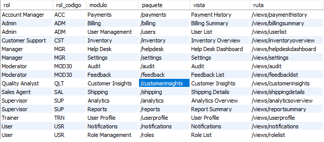
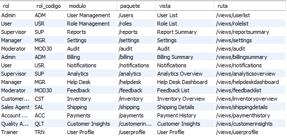

1. repositorio: base_datos_c3_q2
2. Documentar: .md con sql consulta y captura con resultado (captura sin y con filtro (*)(atributos))
3. Casos

Se requiere crear una consulta para:
    Obtener de manera ordenada la lista de vistas y modulos a los que tiene acceso un rol en estado activo. 
    role[name=> rol, route => ruta]
    module[name=> modulo, route => paquete]
    
    Nota: order by atributo
    SELECT 
        * 
    FROM 
        persona p
    ORDER BY p.nombre

